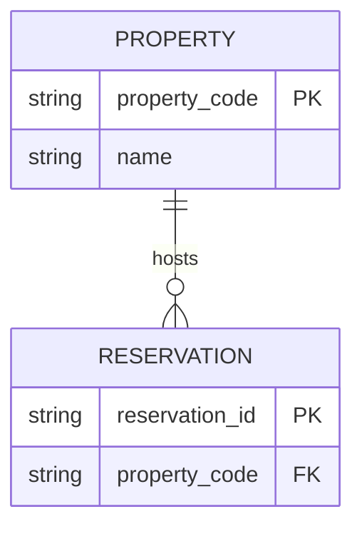

# SchemaBear

<small>by [flyingbear](https://github.com/flyingbearHK)</small>

**SchemaBear** is a small, fast entity-relationship diagram studio for **macOS** and **Windows**.  
Built with [Tauri](https://tauri.app) + Rust. Mermaid in, DBML out, visual editing in between.


## Why SchemaBear?

- **AI-friendly** — paste Mermaid `erDiagram` code and apply
- **Tooling-friendly** — export **DBML** for [dbdiagram.io](https://dbdiagram.io)
- **Human-friendly** — drag cards, edit attributes, auto-arrange, zoom
- **Lightweight** — vanilla TypeScript UI + pure Rust core (`er-core`)

## Features

- Visual ER canvas with rounded orthogonal links and crow’s-foot cardinality
- Zoom controls, scroll-zoom, pan without selection glitches
- Visual editor: entities, attributes (PK/FK/UK), relationships
- Mermaid + DBML import/export, JSON round-trip
- Relationship-aware **Auto Arrange** (L→R / T→B, density, force polish)
- Obstacle-aware relationship routing on the canvas
- Theme: System / Day / Dark
- Built-in **Infor HMS** hospitality sample (illustrative)
- Desktop packages: macOS `.app`/`.dmg`, Windows NSIS `.exe` / `.msi`

## Quick start

### Prerequisites (all platforms)

- [Rust](https://rustup.rs/) stable
- Node.js 20+
- Platform webview deps (see below)

### macOS (Apple Silicon)

```bash
xcode-select --install   # once
npm install
npm run tauri dev
```

Release build:

```bash
npm run tauri:build:mac
```

Artifacts:

```text
src-tauri/target/aarch64-apple-darwin/release/bundle/macos/SchemaBear.app
src-tauri/target/aarch64-apple-darwin/release/bundle/dmg/*.dmg
```

### Windows (x64)

Full step-by-step guide: **[docs/BUILD_WINDOWS.md](docs/BUILD_WINDOWS.md)**

Short version (PowerShell **on a Windows PC**):

```powershell
# One-time: VS Build Tools (C++), Rust MSVC, Node 20+, WebView2
git clone https://github.com/flyingbearHK/schemabear.git
cd schemabear
npm install
npm run tauri dev

# Release installer
npm run tauri:build:win
```

Artifacts:

```text
src-tauri\target\x86_64-pc-windows-msvc\release\bundle\nsis\SchemaBear_*_x64-setup.exe
src-tauri\target\x86_64-pc-windows-msvc\release\bundle\msi\SchemaBear_*_x64_*.msi
```

> **Note:** Windows installers cannot be produced on macOS. Build on Windows, or download CI artifacts from GitHub Actions (`schemabear-windows-x64`).

### Quality gate

```bash
make check          # macOS / Linux with make
npm run check       # any platform
```

## Usage

1. Launch SchemaBear (loads the Infor HMS sample by default).
2. **Zoom** with the top-right controls, mouse wheel, or `+` / `-` / `0` (fit).
3. **Edit visually**: select an entity → **Edit** tab, or **+ Entity**.
4. Or paste Mermaid/DBML under **Code** → **Apply Code** (`⌘/Ctrl+Enter`).
5. **Auto Arrange** / **Arrange** to reflow; **Validate** to check the model.
6. **Export** as DBML, Mermaid, or JSON.

Pan: drag empty canvas, middle-mouse, or hold **Space** while dragging.

### Mermaid example



## Project layout

```text
├── crates/er-core/          # Pure Rust model + Mermaid/DBML + layout/validate
├── src/                     # Vite + TypeScript UI
├── src-tauri/               # Tauri shell (SchemaBear)
├── fixtures/                # Sample diagrams
├── docs/BUILD_WINDOWS.md    # Windows build guide
├── .github/workflows/ci.yml # macOS + Windows CI builds
├── Makefile
└── LICENSE                  # MIT
```

## Architecture

```text
UI (TS/SVG) ──invoke──▶ Tauri commands ──▶ er-core
                              │
                              ├─ Mermaid import/export
                              ├─ DBML import/export
                              ├─ auto_layout / validate
                              └─ sample diagrams
```

`er-core` has **no UI dependencies** — ready for a future CLI or WASM build.

## Releases / downloads

**Latest release:** https://github.com/flyingbearHK/schemabear/releases/latest

| Platform | Package |
|----------|---------|
| macOS Apple Silicon | `.dmg` or `.app.zip` |
| Windows x64 | NSIS `.exe` setup (recommended) or `.msi` |

On every push to `main`, GitHub Actions also:

1. Runs tests on macOS, Windows, and Linux  
2. Builds **macOS arm64** and **Windows x64** bundles as CI artifacts  
3. On tag `v*` (or manual **release** workflow), publishes a GitHub Release with installers  


## License

MIT © flyingbear — see [LICENSE](./LICENSE).

## Disclaimer

The bundled Infor HMS sample is a **teaching fixture** for hospitality data modeling.  
It is not an official Infor schema.
