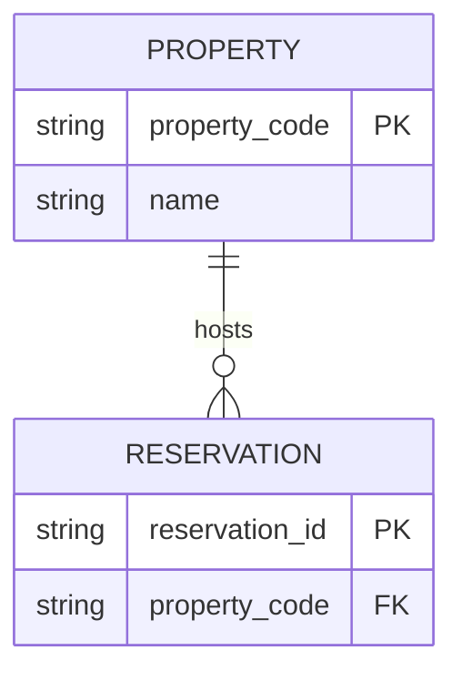

# SchemaBear

<small>by [flyingbear](https://github.com/flyingbearHK)</small>

**SchemaBear** is a small, fast entity-relationship diagram studio for **macOS Apple Silicon**.  
Built with [Tauri](https://tauri.app) + Rust. Mermaid in, DBML out, visual editing in between.


## Why SchemaBear?

- **AI-friendly** — paste Mermaid `erDiagram` code and apply
- **Tooling-friendly** — export **DBML** for [dbdiagram.io](https://dbdiagram.io)
- **Human-friendly** — drag cards, edit attributes, auto-arrange, zoom
- **Lightweight** — vanilla TypeScript UI + pure Rust core (`er-core`)

## Features

- Visual ER canvas with rounded orthogonal links and crow’s-foot cardinality
- Zoom controls, scroll-zoom, pan without selection glitches
- Visual editor: entities, attributes (PK/FK/UK), relationships
- Mermaid + DBML import/export, JSON round-trip
- Relationship-aware **Auto Arrange**
- Theme: System / Day / Dark
- Built-in **Infor HMS** hospitality sample (illustrative)

## Quick start

### Prerequisites

- macOS 11+ on Apple Silicon (`arm64`)
- [Rust](https://rustup.rs/) stable
- Node.js 20+
- Xcode CLT (`xcode-select --install`)

### Develop

```bash
npm install
npm run tauri dev
```

### Quality gate

```bash
make check
```

### Release build (Apple Silicon)

```bash
npm run tauri:build
```

Artifacts:

```text
src-tauri/target/aarch64-apple-darwin/release/bundle/macos/SchemaBear.app
src-tauri/target/aarch64-apple-darwin/release/bundle/dmg/
```

## Usage

1. Launch SchemaBear (loads the Infor HMS sample by default).
2. **Zoom** with the top-right controls, mouse wheel, or `+` / `-` / `0` (fit).
3. **Edit visually**: select an entity → **Edit** tab, or **+ Entity**.
4. Or paste Mermaid/DBML under **Code** → **Apply Code** (`⌘/Ctrl+Enter`).
5. **Auto Arrange** / **Arrange** to reflow; **Validate** to check the model.
6. **Export** as DBML, Mermaid, or JSON.

Pan: drag empty canvas, middle-mouse, or hold **Space** while dragging.

### Mermaid example



## Project layout

```text
├── crates/er-core/     # Pure Rust model + Mermaid/DBML + layout/validate
├── src/                # Vite + TypeScript UI
├── src-tauri/          # Tauri shell (SchemaBear)
├── fixtures/           # Sample diagrams
├── examples/           # Exported DBML / Mermaid
├── Makefile
└── LICENSE             # MIT
```

## Architecture

```text
UI (TS/SVG) ──invoke──▶ Tauri commands ──▶ er-core
                              │
                              ├─ Mermaid import/export
                              ├─ DBML import/export
                              ├─ auto_layout / validate
                              └─ sample diagrams
```

`er-core` has **no UI dependencies** — ready for a future CLI or WASM build.

## License

MIT © flyingbear — see [LICENSE](./LICENSE).

## Disclaimer

The bundled Infor HMS sample is a **teaching fixture** for hospitality data modeling.  
It is not an official Infor schema.
