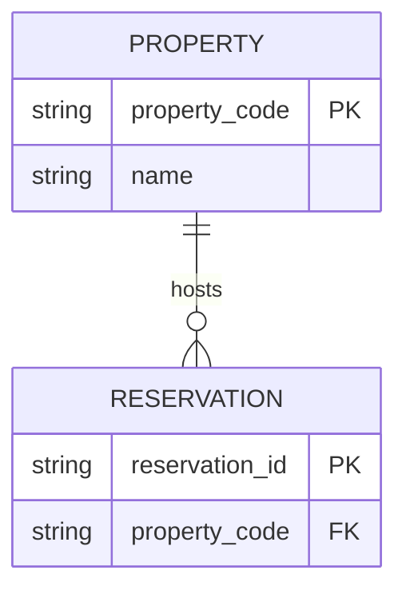

# ER Diagram

Small, efficient **entity-relationship diagram** studio for **macOS Apple Silicon**, built with [Tauri](https://tauri.app) + Rust.

Designed for data-model work (including hospitality / HMS-style models) where AI can generate Mermaid ER code and humans need a fast visual tool plus export into mainstream ER tooling.


## Features

- **Visual ER canvas** — entity cards, crow’s-foot relationships, pan/zoom, drag-to-reposition
- **Mermaid import** — paste `erDiagram` code from AI / mermaid.live and apply
- **DBML export/import** — [dbdiagram.io](https://dbdiagram.io) compatible interchange (primary export target)
- **JSON export** — full internal model for tooling / round-trips
- **Auto-layout + validation**
- **Built-in MOHG / Infor HMS inspired sample** (illustrative, not a production schema)
- **Expandable core** — pure Rust crate (`er-core`) reusable by CLI/WASM later

## Quick start

### Prerequisites

- macOS 11+ on Apple Silicon (`arm64`)
- [Rust](https://rustup.rs/) stable
- Node.js 20+
- Xcode CLT (`xcode-select --install`)

### Develop

```bash
npm install
npm run tauri dev
```

### Quality gate

```bash
make check
```

### Release build (Apple Silicon)

```bash
npm run tauri:build
```

Artifacts land under `src-tauri/target/aarch64-apple-darwin/release/bundle/`.

## Usage

1. Launch the app (loads the HMS sample by default).
2. Paste Mermaid into the **Code** panel (or Import a `.mmd` / `.dbml` file).
3. Click **Apply Code** (`⌘/Ctrl+Enter`).
4. Drag entities, **Layout** if needed, **Validate**.
5. **Export** as **DBML** (dbdiagram.io), Mermaid, or JSON.

### Mermaid example



### Why DBML for export?

DBML is the native language of **dbdiagram.io** and is widely used as a lightweight ER interchange format. Mermaid remains first-class for AI generation and docs.

## Project layout

```text
├── crates/er-core/          # Pure Rust model + Mermaid/DBML + layout/validate
├── src/                     # Vite + TypeScript UI
├── src-tauri/               # Tauri shell + IPC commands
├── fixtures/                # Sample diagrams
├── AGENTS.md                # Agent/harness instructions
├── Makefile                 # check / test / build
└── LICENSE                  # MIT
```

### Extension points

| Layer | Add later without rewrite |
|-------|---------------------------|
| `er-core` | SQL DDL export, PlantUML, GraphQL SDL, physical/logical layers |
| Tauri commands | File watcher, multi-diagram workspace, native dialogs |
| UI | Undo stack, multi-select, theme packs, print/PDF |
| Distribution | Homebrew cask, notarized DMG CI |

## Architecture

```text
UI (TS/SVG) ──invoke──▶ Tauri commands ──▶ er-core
                              │
                              ├─ import_mermaid / export_mermaid
                              ├─ import_dbml / export_dbml
                              ├─ auto_layout / validate
                              └─ sample diagrams
```

`er-core` has **no UI dependencies**. Future `er-cli` or WASM builds can depend on it directly.

## License

MIT — see [LICENSE](./LICENSE).

## Disclaimer

The bundled MOHG/HMS sample is a **teaching fixture** for hospitality data modeling. It is not an official Infor or MOHG schema.
